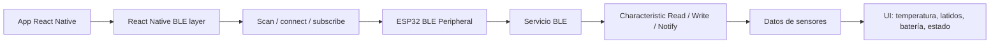

# Planificacion Bluetooth

Te preparo un esquema completo y práctico para conectar un ESP32 con una app React Native, con librerías, flujo de datos, pasos de implementación y una propuesta realista para este proyecto.

## Arquitectura completa de Bluetooth para ESP32 + React Native

En este proyecto, la parte visual ya está montada sobre Expo + React Native, según se ve en `package.json` y `app.json`, pero no hay integración real de Bluetooth aún. La arquitectura que te conviene para ESP32 + app móvil es esta:



---

## 1) ¿Qué piezas participan?

### A. App móvil (React Native)
Es la parte “central” que:
- busca dispositivos BLE
- se conecta al ESP32
- lee/escribe características
- recibe notificaciones
- actualiza la interfaz

### B. ESP32
Actúa como “periférico BLE”:
- publica un servicio BLE
- expone una o varias characteristics
- puede leer órdenes desde la app
- puede enviar datos como JSON, bytes o texto

### C. Protocolo de comunicación
Lo normal es:
- BLE GATT
- servicio UUID
- characteristic UUID
- notifications / indications
- read/write

---

## 2) Librerías exactas recomendadas

### Para la app React Native
La librería más usada y recomendada es:

- `react-native-ble-plx`

También suele necesitarse esta para Expo/Dev Client:

- `expo-dev-client`

Y si quieres convertir datos binarios o bases64:

- `react-native-base64`

### Para el firmware del ESP32
En Arduino/ESP32, lo más común es:

- `NimBLE-Arduino` o `ESP32 BLE Arduino`
- `ArduinoJson` para enviar JSON

### Instalación recomendada
En tu proyecto Expo:

```bash
npx expo install expo-dev-client
npm install react-native-ble-plx react-native-base64
```

Si prefieres usar el flujo más clásico de React Native sin Expo:
```bash
npm install react-native-ble-plx
```

> Importante: en Expo, la app debe ser un “development build” o “custom dev client”, porque Expo Go no soporta módulos nativos BLE.

---

## 3) Arquitectura realista para este caso

### Modelo recomendado
Para una app tipo “FitPet” o dispositivo wearable:

- ESP32 = sensor/periférico
- móvil = central
- comunicación = BLE GATT

### Servicios que normalmente se definen
- `Service UUID`: identificador del dispositivo
- `Characteristic UUID` para:
  - lectura de estado
  - escritura de comandos
  - notificaciones de datos

Ejemplo de diseño:
- `0001...` → estado del dispositivo
- `0002...` → comandos del móvil al ESP32
- `0003...` → datos del sensor al móvil

Ejemplo de payload:
```json
{
  "type": "sensor",
  "temperature": 36.7,
  "heartRate": 82,
  "battery": 92,
  "status": "connected"
}
```

---

## 4) Flujo de comunicación

### A. Escaneo
La app busca dispositivos BLE:
- nombre del ESP32
- servicio UUID
- MAC o identificador

### B. Conexión
La app se conecta al ESP32:
- `connectToDevice(deviceId)`

### C. Descubrimiento del servicio
La app lee los servicios y características:
- `services()`
- `characteristics()`

### D. Suscripción
Se activa notificación para recibir datos:
- `monitorCharacteristicForDevice()`

### E. Escritura
La app puede mandar comandos:
- “start”
- “stop”
- “get_status”
- “set_mode”

### F. Lectura
La app solicita o recibe datos:
- `readCharacteristicForDevice()`
- `monitorCharacteristicForDevice()`

---

## 5) Librerías y configuración exacta

### A. En Android
Necesitas permisos en AndroidManifest.xml:

```xml
<uses-permission android:name="android.permission.BLUETOOTH" />
<uses-permission android:name="android.permission.BLUETOOTH_ADMIN" />
<uses-permission android:name="android.permission.ACCESS_FINE_LOCATION" />
<uses-permission android:name="android.permission.ACCESS_COARSE_LOCATION" />

<!-- Android 12+ -->
<uses-permission android:name="android.permission.BLUETOOTH_SCAN" />
<uses-permission android:name="android.permission.BLUETOOTH_CONNECT" />
```

### B. En iOS
En Info.plist:

```plist
<key>NSBluetoothAlwaysUsageDescription</key>
<string>La aplicación necesita Bluetooth para conectarse al dispositivo ESP32.</string>
<key>NSBluetoothPeripheralUsageDescription</key>
<string>La aplicación usa Bluetooth para comunicar con el sensor.</string>
```

---

## 6) Estructura recomendada del proyecto

Una estructura tipo:

```txt
src/
  ble/
    BleManager.ts
    useBle.ts
    types.ts
  screens/
    DeviceConnectScreen.tsx
    SensorScreen.tsx
  services/
    sensorService.ts
```

### Módulos recomendados
- `BleManager.ts`: encapsula la conexión
- `useBle.ts`: hook para estado de conexión y datos
- `types.ts`: definiciones de dispositivos y payloads
- `DeviceConnectScreen.tsx`: lista y conecta dispositivos
- `SensorScreen.tsx`: muestra lectura en tiempo real

---

## 7) Código base de ejemplo para React Native

### Hook de BLE
```ts
import { BleManager, Device } from 'react-native-ble-plx';

const manager = new BleManager();

export function useBle() {
  const scanForDevices = async () => {
    const devices = await manager.startDeviceScan(null, null, (error, device) => {
      if (error) {
        console.error(error);
        return;
      }
      if (device) {
        console.log('Device found:', device.name);
      }
    });

    return devices;
  };

  return { scanForDevices };
}
```

### Conectar a un ESP32
```ts
const device = await manager.connectToDevice('DEVICE_ID');
await device.discoverAllServicesAndCharacteristics();
```

### Leer una characteristic
```ts
const services = await device.services();
const service = services.find(s => s.uuid === 'SERVICE_UUID');

const characteristics = await service.characteristics();
const char = characteristics.find(c => c.uuid === 'CHAR_UUID');

const value = await device.readCharacteristicForDevice(
  service.uuid,
  char.uuid,
  'DEVICE_ID'
);

console.log(value.value);
```

### Recibir notificaciones
```ts
await device.monitorCharacteristicForDevice(
  'DEVICE_ID',
  'SERVICE_UUID',
  'CHAR_UUID',
  (error, characteristic) => {
    if (error) {
      console.error(error);
      return;
    }

    if (characteristic?.value) {
      const decoded = Buffer.from(characteristic.value, 'base64').toString('utf-8');
      console.log(decoded);
    }
  }
);
```

---

## 8) Código base para ESP32 (firmware)

Usando Arduino/ESP32 BLE:

```cpp
#include <BLEDevice.h>
#include <BLEServer.h>
#include <BLEUtils.h>
#include <BLE2902.h>

#define SERVICE_UUID        "12345678-1234-1234-1234-123456789abc"
#define CHARACTERISTIC_RX   "87654321-4321-4321-4321-cba987654321"
#define CHARACTERISTIC_TX   "11111111-2222-3333-4444-555555555555"

BLEServer* pServer = NULL;
BLECharacteristic* pTxCharacteristic = NULL;
BLECharacteristic* pRxCharacteristic = NULL;

class MyCallbacks: public BLECharacteristicCallbacks {
  void onWrite(BLECharacteristic *pCharacteristic) override {
    std::string value = pCharacteristic->getValue();
    if (value.length() > 0) {
      Serial.println("Received:");
      Serial.println(value.c_str());
    }
  }
};

void setup() {
  Serial.begin(115200);

  BLEDevice::init("FitPet_ESP32");
  pServer = BLEDevice::createServer();

  BLEService *pService = pServer->createService(SERVICE_UUID);

  pRxCharacteristic = pService->createCharacteristic(
    CHARACTERISTIC_RX,
    BLECharacteristic::PROPERTY_WRITE
  );

  pTxCharacteristic = pService->createCharacteristic(
    CHARACTERISTIC_TX,
    BLECharacteristic::PROPERTY_READ | BLECharacteristic::PROPERTY_NOTIFY
  );

  pTxCharacteristic->addDescriptor(new BLE2902());
  pRxCharacteristic->setCallbacks(new MyCallbacks());

  pService->start();

  BLEAdvertising *pAdvertising = BLEDevice::getAdvertising();
  pAdvertising->addServiceUUID(SERVICE_UUID);
  pAdvertising->start();

  Serial.println("BLE server started");
}

void loop() {
  static unsigned long last = 0;
  if (millis() - last > 1000) {
    last = millis();

    String payload = "{\"type\":\"sensor\",\"temperature\":36.7,\"heartRate\":82,\"battery\":92}";
    pTxCharacteristic->setValue(payload.c_str());
    pTxCharacteristic->notify();
  }
}
```

> Esto es una base funcional para empezar, no una solución final. Para producción conviene agregar:
- validación de payload
- reconexión robusta
- checksum / seguridad
- manejo de buffers
- debounce y timestamps

---

## 9) Pasos exactos para implementar en este proyecto

1. Asegurar que el proyecto usa un build nativo:
   - instalar `expo-dev-client`
   - crear un dev build
   - no depender de Expo Go

2. Instalar BLE:
```bash
npx expo install expo-dev-client
npm install react-native-ble-plx react-native-base64
```

3. Configurar permisos Android e iOS.

4. Crear un servicio para BLE:
   - `BleManager.ts`
   - `useBle.ts`

5. Definir UUIDs del ESP32 y usarlos como contrato fijo.

6. Programar el ESP32 con un servicio BLE y characteristics.

7. En la app:
   - escaneo
   - conexión
   - subscribe
   - handlers para datos
   - render en pantalla

8. Validar flujo:
   - app detecta ESP32
   - conexión OK
   - recepción de payload
   - render final en UI

9. Añadir manejo de errores:
   - pérdida de conexión
   - dispositivo no encontrado
   - buffer vacío
   - desconexión inesperada

---

## 10) Recomendaciones de diseño para FitPet

Para este tipo de app, mi recomendación es esta:

### Mantener una capa BLE separada
No mezclar la lógica de Bluetooth con la pantalla:
- `ble/scan.ts`
- `ble/connect.ts`
- `ble/subscribe.ts`
- `ble/parse.ts`

### Definir un contrato fijo
Por ejemplo:
- `serviceUuid`
- `commandCharacteristic`
- `dataCharacteristic`
- payload JSON
- `{"type":"data","value":...}`

### Centralizar los estados
Estados reales:
- idle
- scanning
- connecting
- connected
- reading
- error
- disconnected

Esto te evita bugs en UI y mejora mucho la estabilidad.

---

## 11) Qué elegir para este proyecto

Si tu objetivo es un dispositivo con ESP32 y una app móvil, la apuesta más sólida es:

- React Native + Expo + `react-native-ble-plx`
- ESP32 con BLE + `NimBLE-Arduino`
- JSON como formato de intercambio
- app con pantalla de conexión + pantalla de datos en vivo

---

## 12) Resumen final

### Lo que tienes ahora
- una app visual de Expo con React Native
- buena base para UI
- sin integración BLE

### Lo que necesitas para conectar ESP32
- `react-native-ble-plx`
- `expo-dev-client`
- permisos nativos
- firmware ESP32 con servicio BLE
- UUIDs fijas
- flujo de escaneo, conexión, suscripción y lectura


# Supabase

npzfzqrukvfqygipptkj
VITE_SUPABASE_URL=https://npzfzqrukvfqygipptkj.supabase.co
VITE_SUPABASE_PUBLISHABLE_KEY=sb_publishable_kuDe53XlyjsS8akfl-z2aw_oGQgPyyH

API KEY = sb_publishable_kuDe53XlyjsS8akfl-z2aw_oGQgPyyH


![[Pasted image 20260926203948.png]]

Ahora funciona! Lo que quiero que hagas ahora es mejorar la vista del login para que sea lo más atractivo posible, manteniendo la línea de arte que tiene el proyecto actualmente. Primero haz un onboarding de introducción para la experiencia fitpet, por ejemplo la imagen que te mande

1. Bienvenido a Fitpet!
    
    1. Tu mascota y tú en un solo lugar
        
2. Compite contra otros usuarios
    
    1. Veamos quién es el más rápido de todos
        
3. Haz que tu mascota sea única!
    
    1. Más que una mascota, un amigo
        
4. Iniciar sesión o registrarse